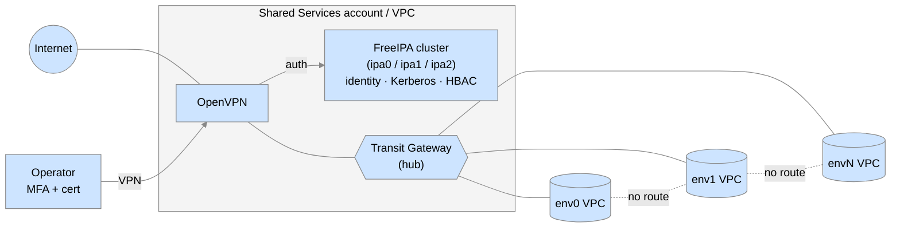
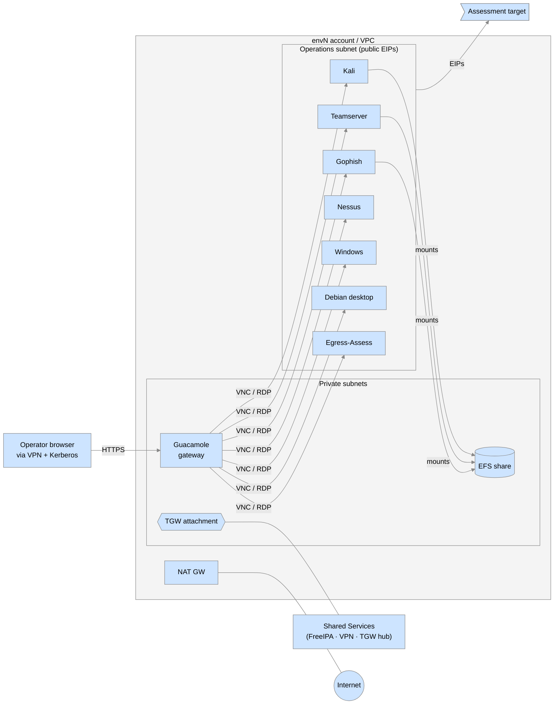
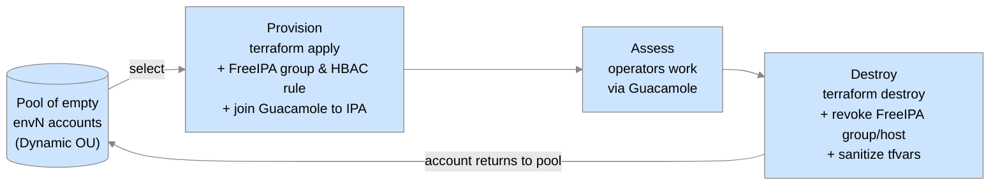

# COOL architecture #

This document describes how COOL is laid out and why.  It is the
conceptual map you should have in your head before you open any of
the Terraform.

The design has three layers, stacked:

1. **AWS account topology** — a multi-account foundation that
   separates concerns and blast radius.
2. **Shared-services hub** — long-lived infrastructure (network hub,
   identity, VPN) that every assessment environment depends on.
3. **Assessment environments** — short-lived, per-engagement spokes
   that are vended on demand and destroyed when the engagement ends.

---

## 1. AWS account topology ##

COOL runs inside a single **AWS Organization** managed by **AWS
Control Tower**.  Control Tower provides the landing zone, the SSO
(IAM Identity Center) entry point for administrators, and the audit /
log-archive guard-rail accounts.

```text
AWS Organization (Control Tower landing zone)
│
├── Master / management account
├── Security OU                ── Control Tower managed
│   ├── Audit
│   └── Log Archive
│
├── Static OU                  ── long-lived COOL core
│   ├── Terraform              S3 + DynamoDB remote state for everything
│   ├── Users                  IAM users that assume roles everywhere else
│   ├── DNS                    Route 53 public zones, ACME/cert bucket
│   ├── Images                 Packer-built golden AMIs + SSM Parameter Store secrets
│   └── Shared Services        VPC hub, Transit Gateway, FreeIPA, OpenVPN
│
└── Dynamic OU                 ── one account per assessment environment
    ├── env0
    ├── env1
    ├── env2
    └── …envN
```

### Why one account per concern? ###

- **Terraform** account: holds the single S3 state bucket and
  DynamoDB lock table.  Every other repo's `backend.tf` points here,
  so state is centralized and access to it can be tightly scoped.
- **Users** account: the only place IAM *users* exist.  Humans
  authenticate here (long-lived credentials + MFA) and then
  `sts:AssumeRole` into purpose-specific roles in every other
  account.  This is what makes the dozens of `cool-*-iam` repos work
  — they create *roles*, not users.
- **DNS** account: owns the public hosted zone(s) and the S3 bucket
  where Let's Encrypt certificates are stored.  Isolating DNS means
  the credential that can edit your public zone is not the same one
  that can launch EC2.
- **Images** account: where Packer builds AMIs and where shared
  secrets (FreeIPA admin password, OpenVPN TLS key, etc.) live in SSM
  Parameter Store.  AMIs are built once here and **shared** (via
  launch permissions and a shared KMS key) into every Dynamic
  account.
- **Shared Services** account: the network and identity hub
  (described below).
- **Dynamic / `env<N>`** accounts: each assessment gets its own AWS
  account from a pre-provisioned pool.  Account-level separation is
  the strongest isolation primitive AWS offers — IAM, quotas, billing
  and blast radius are all naturally scoped.

The account skeleton is created and bootstrapped by
[`cisagov/cool-accounts`](https://github.com/cisagov/cool-accounts);
new Dynamic accounts are minted through Control Tower Account Factory
by [`cisagov/provision-aws-account`](https://github.com/cisagov/provision-aws-account)
and finished by
[`cisagov/cool-configure-aws-account`](https://github.com/cisagov/cool-configure-aws-account).

---

## 2. Shared-services hub ##

The Shared Services account contains everything that is shared across
all assessments and that you want to deploy *once*.



### Networking — hub and spoke ###

[`cool-sharedservices-networking`](https://github.com/cisagov/cool-sharedservices-networking)
creates:

- The Shared Services VPC with public and private subnets, NAT
  gateways, and the standard set of interface/gateway VPC endpoints
  (SSM, EC2, STS, S3, CloudWatch) so private instances can reach AWS
  APIs without internet egress.
- An **AWS Transit Gateway** that is shared (via AWS RAM) with every
  Dynamic account.  Each assessment VPC attaches to this TGW.
- **Per-spoke route tables.**  Each `env<N>` attachment gets its own
  TGW route table containing exactly two routes: itself, and Shared
  Services.  Spokes therefore cannot route to each other — assessment
  environments are mutually invisible at layer 3.
- A private Route 53 zone for the internal COOL domain.

### Identity — FreeIPA ###

[`cool-sharedservices-freeipa`](https://github.com/cisagov/cool-sharedservices-freeipa)
deploys a three-node FreeIPA cluster (`ipa0` master + `ipa1`/`ipa2`
replicas) in the private subnets.  FreeIPA provides:

- The user directory for *operators* (distinct from AWS IAM, which is
  for *administrators*).
- A Kerberos KDC — operators `kinit` to get a forwardable ticket that
  is honored by Guacamole and SSH across the estate.
- **Host-Based Access Control (HBAC)** — the mechanism that decides
  *which* assessment environments an operator may enter.  Each
  environment has a FreeIPA user-group (`env<N>_<workspace>`) and an
  HBAC rule binding that group to that environment's Guacamole host.
  Adding or removing a user from an engagement is a group-membership
  edit.
- Optional certificate / smart-card mapping for organisations that
  use hardware tokens (CISA maps PIV cards here; you can map
  whatever PKI you have, or use passwords + OTP).

### Remote access — OpenVPN ###

[`cool-sharedservices-openvpn`](https://github.com/cisagov/cool-sharedservices-openvpn)
deploys an OpenVPN server in the public subnet.  It authenticates
against FreeIPA, requires MFA, and is the **only** network path from
the outside world into the Shared Services and assessment VPCs.  Its
TLS key, DH params and server certificate are pulled from SSM
Parameter Store and the cert bucket at boot.

### Break-glass — SSM Session Manager ###

Every COOL instance is enrolled in AWS Systems Manager.
Administrators can open a shell on any host with
`aws ssm start-session` using a `*-startstopssmsession` IAM role —
no bastion, no inbound SSH, and full session logging.  This is the
path used for FreeIPA cluster setup, OpenVPN re-enrolment, and
certificate redeploys.

---

## 3. Assessment environments (the spokes) ##

An assessment environment is produced by running
[`cool-assessment-terraform`](https://github.com/cisagov/cool-assessment-terraform)
in a Terraform **workspace named for the environment** (e.g.
`env12-production`), pointed at one of the pre-provisioned Dynamic
accounts.



What `cool-assessment-terraform` creates per environment:

- A VPC with a private subnet (Guacamole, EFS) and an **operations
  subnet** whose instances get Elastic IPs so they can present
  attributable public addresses to the assessment target.
- A Transit Gateway attachment + route back to Shared Services.
- A **Guacamole** instance — the browser-based remote desktop
  gateway.  It is FreeIPA-domain-joined; HBAC decides who gets in.
  A sidecar
  ([`guacscanner`](https://github.com/cisagov/guacscanner)) watches
  the VPC and auto-creates Guacamole connections for every operator
  instance that appears, so the connection list is always current.
- Zero or more **operator instances**, count-driven from the tfvars
  file.  Supported types (each backed by a `*-packer` AMI from the
  Images account): Kali, Cobalt Strike teamserver, Gophish, Nessus,
  Pentest Portal, Egress-Assess, Samba, Terraformer, Windows
  (Commando VM / Server), Debian desktop.
- An **EFS** filesystem mounted on the operator instances for shared
  working data within the engagement.
- IAM instance profiles, CloudWatch alarms, VPC flow logs, and SSM
  registration for every instance.

### Lifecycle ###



The AWS account itself is **not** deleted between engagements — it is
expensive to create and re-baseline — so a small pool of `env<N>`
accounts is kept warm and rotated.  "Destroy" means: `terraform
destroy` the VPC and instances, delete the FreeIPA group / HBAC rule
/ Guacamole host entry, sanitize the tfvars file, and mark the
account available again.

---

## Identity and access summary ##

There are two completely separate identity planes; keeping them
straight makes the IAM repos much easier to read.

| Plane | Who | Lives in | Auth path | Grants |
| --- | --- | --- | --- | --- |
| **Cloud / admin** | People who *build and run* COOL | AWS IAM Identity Center (SSO) → IAM user in **Users** account | SSO + MFA → `sts:AssumeRole` into per-account roles (e.g. `ProvisionAccount`, `StartStopSSMSession`) | Ability to run Terraform, open SSM sessions, read Parameter Store |
| **Operator** | People who *use* an assessment environment | **FreeIPA** in Shared Services | OpenVPN (MFA) → `kinit` Kerberos → Guacamole (HBAC) | Remote desktop into the instances of the environments their FreeIPA groups allow |

The `cool-*-iam` family of repos all operate on the *cloud* plane:
they create IAM groups in the Users account and matching assumable
roles in target accounts so that, for example, "assessment
provisioners" can apply `cool-assessment-terraform` but nothing
else.

---

## Certificates and DNS ##

Public-facing endpoints (OpenVPN, each environment's Guacamole) need
real TLS certificates.

- [`cool-dns-certboto`](https://github.com/cisagov/cool-dns-certboto)
  provisions an S3 bucket and Route 53 permissions in the **DNS**
  account.
- [`certboto-docker`](https://github.com/cisagov/certboto-docker)
  is a containerized Certbot that performs the DNS-01 challenge
  against that Route 53 zone and writes the issued certificate into
  the bucket.
- Instances pull their certificate from the bucket at boot via a
  cloud-init script and an IAM role created by
  [`cert-read-role-tf-module`](https://github.com/cisagov/cert-read-role-tf-module).

Public DNS zones themselves are managed by `cool-dns-<zone>` root
configs (CISA's are `cool-dns-cyber.dhs.gov` and
`cool-dns-57.69.64.in-addr.arpa` — you fork these and substitute
your own domain).

---

## Where the code lives ##

Every box in the diagrams above maps to one or more repositories.
[REPOSITORIES.md](REPOSITORIES.md) is the full cross-reference; the
deployment order that turns an empty AWS Organization into a working
COOL is in [GETTING-STARTED.md](GETTING-STARTED.md).
