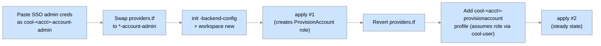

# Phase 4 — Bootstrap the core accounts #

This phase applies the `cool-accounts` baseline to every remaining core account.  Each bootstrap creates a `ProvisionAccount` IAM role that trusts the `Users` account, so that from here on all Terraform runs are driven by your permanent IAM user via role assumption instead of pasted Identity Center session tokens.

The order matters for the first three accounts because of the second circular dependency (see [GETTING-STARTED.md § About the ordering](GETTING-STARTED.md#about-the-ordering)):

```text
users/    →  master/  →  (revert leftovers in terraform/ + users/)  →  audit/, dns/, images/, log-archive/, shared-services/
```

# Prerequisites #

* [Bootstrap the Terraform Backend](Bootstrap-the-Terraform-Backend.md) is complete: `<state_bucket>` and `<lambda_bucket>` exist and hold state for `cool-accounts/terraform`, and `disable_inactive_iam_users.zip` is uploaded to `<lambda_bucket>`.
* Your `cool-terraform-account-admin` and `cool-master-account-admin` credential blocks are still valid (refresh from `<sso_url>` if expired).

# The general per-account bootstrap pattern #

Every account after `terraform` follows the same recipe.  It is spelled out in full for `users/` and `master/` below because those two carry extra revert steps; for the remaining five it is abbreviated to a table.



# Bootstrap the Users account #

This account holds the IAM users whose credentials source every `cool-*-provisionaccount` profile.

1. From `<sso_url>`, copy `AWSAdministratorAccess` credentials for the **Users** account into `~/.aws/<workspace>_credentials`:

    ```ini
    [cool-users-account-admin]
    aws_access_key_id = <ASIA…>
    aws_secret_access_key = <…>
    aws_session_token = <…>
    ```

    Refresh `[cool-terraform-account-admin]` and `[cool-master-account-admin]` at the same time if they have expired.

1. In `~/cool/src/cool-accounts/users/providers.tf`:
    1. Comment out `profile = "cool-users-provisionaccount"` on the default provider; uncomment `profile = "cool-users-account-admin"`.
    1. Comment out `profile = "cool-master-organizationsreadonly"` on the `organizationsreadonly` provider; uncomment `profile = "cool-master-account-admin"`.
1. In `~/cool/src/cool-accounts/users/backend.tf`, comment out `profile = "cool-terraform-backend"` and uncomment `profile = "cool-terraform-account-admin"`.
1. Create `<tfvars_repo>/cool-accounts/users/<workspace>.tfvars`:

    ```hcl
    godlike_usernames = [
      "<first.last>",
    ]

    lambda_bucket_name = "<lambda_bucket>"
    lambda_key         = "disable_inactive_iam_users.zip"

    tags = {
      Team        = "<your_team_name>"
      Application = "COOL - Users Account"
      Workspace   = "<workspace>"
    }
    ```

    `godlike_usernames` are the IAM users allowed to assume `ProvisionAccount` in every core account.  List every administrator on your team.

1. Initialize and apply:

    ```console
    cd ~/cool/src/cool-accounts/users
    terraform init -upgrade \
      -backend-config=<tfvars_repo>/cool-accounts/users/<workspace>.tfconfig
    terraform workspace new <workspace>
    terraform apply -var-file=<tfvars_repo>/cool-accounts/users/<workspace>.tfvars
    ```

## Create your permanent IAM access key ##

The apply above created an IAM user named `<first.last>` in the `Users` account.  Give it an access key:

1. From `<sso_url>`, open the **Users** account console with `AWSAdministratorAccess`.
1. Go to **IAM › Users › `<first.last>` › Security credentials › Create access key**.
1. Choose **Command Line Interface (CLI)**, acknowledge, and **Create access key**.
1. Add the key to `~/.aws/<workspace>_credentials` as your permanent base profile:

    ```ini
    [cool-user]
    aws_access_key_id     = <AKIA…>
    aws_secret_access_key = <…>
    ```

## Add the permanent role-assumption profiles ##

Add these to `~/.aws/<workspace>_config` (or your `aws-profile-sync` roles file).  Substitute the twelve-digit account IDs you recorded in [Set Up the Management Account](Set-Up-the-Management-Account.md):

```ini
[profile cool-terraform-backend]
role_arn = arn:aws:iam::<terraform_account_id>:role/AccessTerraformBackend
source_profile = cool-user
role_session_name = <first.last>
region = <region>

[profile cool-terraform-provisionaccount]
role_arn = arn:aws:iam::<terraform_account_id>:role/ProvisionAccount
source_profile = cool-user
role_session_name = <first.last>
region = <region>

[profile cool-users-provisionaccount]
role_arn = arn:aws:iam::<users_account_id>:role/ProvisionAccount
source_profile = cool-user
role_session_name = <first.last>
region = <region>

[profile cool-master-provisionaccount]
role_arn = arn:aws:iam::<management_account_id>:role/ProvisionAccount
source_profile = cool-user
role_session_name = <first.last>
region = <region>

[profile cool-master-organizationsreadonly]
role_arn = arn:aws:iam::<management_account_id>:role/OrganizationsReadOnly
source_profile = cool-user
role_session_name = <first.last>
region = <region>

[profile cool-audit-provisionaccount]
role_arn = arn:aws:iam::<audit_account_id>:role/ProvisionAccount
source_profile = cool-user
role_session_name = <first.last>
region = <region>

[profile cool-dns-provisionaccount]
role_arn = arn:aws:iam::<dns_account_id>:role/ProvisionAccount
source_profile = cool-user
role_session_name = <first.last>
region = <region>

[profile cool-images-provisionaccount]
role_arn = arn:aws:iam::<images_account_id>:role/ProvisionAccount
source_profile = cool-user
role_session_name = <first.last>
region = <region>

[profile cool-logarchive-provisionaccount]
role_arn = arn:aws:iam::<logarchive_account_id>:role/ProvisionAccount
source_profile = cool-user
role_session_name = <first.last>
region = <region>

[profile cool-sharedservices-provisionaccount]
role_arn = arn:aws:iam::<sharedservices_account_id>:role/ProvisionAccount
source_profile = cool-user
role_session_name = <first.last>
region = <region>

[profile cool-sharedservices-startstopssmsession]
role_arn = arn:aws:iam::<sharedservices_account_id>:role/StartStopSSMSession
source_profile = cool-user
role_session_name = <first.last>
region = <region>
```

Only `cool-terraform-*` and `cool-users-provisionaccount` will actually work at this point; the others start working as each account is bootstrapped below.

## Switch users/ and terraform/ to permanent profiles ##

You now have a real `cool-user` principal, so unwind the temporary edits made in `users/` and (partially) in [Bootstrap the Terraform Backend](Bootstrap-the-Terraform-Backend.md):

1. `cool-accounts/users/providers.tf` — revert the default provider back to `profile = "cool-users-provisionaccount"`.  **Leave** the `organizationsreadonly` provider on `cool-master-account-admin` for now.
1. `cool-accounts/users/backend.tf` — revert to `profile = "cool-terraform-backend"`.
1. `cool-accounts/terraform/providers.tf` — revert the default provider back to `profile = "cool-terraform-provisionaccount"`.  **Leave** the `organizationsreadonly` provider on `cool-master-account-admin` for now.
1. `cool-accounts/terraform/backend.tf` — revert to `profile = "cool-terraform-backend"`.
1. Re-init and re-apply both to prove the permanent profiles work:

    ```console
    cd ~/cool/src/cool-accounts/users
    terraform init -reconfigure \
      -backend-config=<tfvars_repo>/cool-accounts/users/<workspace>.tfconfig
    terraform apply -var-file=<tfvars_repo>/cool-accounts/users/<workspace>.tfvars

    cd ~/cool/src/cool-accounts/terraform
    terraform init -reconfigure \
      -backend-config=<tfvars_repo>/cool-accounts/terraform/<workspace>.tfconfig
    terraform apply -var-file=<tfvars_repo>/cool-accounts/terraform/<workspace>.tfvars
    ```

    Both applies should show **No changes**.

# Bootstrap the management account #

The `cool-accounts/master` root creates (among other things) the `OrganizationsReadOnly` role that the `organizationsreadonly` provider in every other root assumes, and the `ControlTowerAdmin` and `AdministerSSO` roles used later for account provisioning.

1. In `~/cool/src/cool-accounts/master/providers.tf`, comment out `profile = "cool-master-provisionaccount"` on the default provider and uncomment `profile = "cool-master-account-admin"`.
1. Create `<tfvars_repo>/cool-accounts/master/<workspace>.tfvars`:

    ```hcl
    lambda_bucket_name = "<lambda_bucket>"
    lambda_key         = "disable_inactive_iam_users.zip"

    tags = {
      Team        = "<your_team_name>"
      Application = "COOL - Management Account"
      Workspace   = "<workspace>"
    }
    ```

1. Initialize, create the workspace, and apply:

    ```console
    cd ~/cool/src/cool-accounts/master
    terraform init -upgrade \
      -backend-config=<tfvars_repo>/cool-accounts/master/<workspace>.tfconfig
    terraform workspace new <workspace>
    terraform apply -var-file=<tfvars_repo>/cool-accounts/master/<workspace>.tfvars
    ```

1. Revert `providers.tf` back to `profile = "cool-master-provisionaccount"`.
1. Re-apply — should show **No changes**:

    ```console
    terraform apply -var-file=<tfvars_repo>/cool-accounts/master/<workspace>.tfvars
    ```

## Close the organizationsreadonly loop ##

The real `OrganizationsReadOnly` role now exists in the management account, so finish reverting the two remaining temporary edits:

1. `cool-accounts/terraform/providers.tf` — revert the `organizationsreadonly` provider back to `profile = "cool-master-organizationsreadonly"`.
1. `cool-accounts/users/providers.tf` — same.
1. Re-apply both roots one more time; both should show **No changes**.

At this point `git status` in `cool-accounts/` should be clean — every temporary edit has been reverted.

## Grant Account Factory portfolio access (revisited) ##

If you skipped this step in [Set Up the Management Account](Set-Up-the-Management-Account.md) because the `ControlTowerAdmin` role did not exist yet, do it now: [Service Catalog › Portfolios › AWS Control Tower Account Factory Portfolio › Access › Grant access › Roles › `ControlTowerAdmin`](https://console.aws.amazon.com/servicecatalog/home).  Also add these two profiles to `~/.aws/<workspace>_config` for later phases:

```ini
[profile cool-master-controltoweradmin]
role_arn = arn:aws:iam::<management_account_id>:role/ControlTowerAdmin
source_profile = cool-user
role_session_name = <first.last>
region = <region>

[profile cool-master-administersso]
role_arn = arn:aws:iam::<management_account_id>:role/AdministerSSO
source_profile = cool-user
role_session_name = <first.last>
region = <region>
```

# Bootstrap the remaining core accounts #

`Audit`, `DNS`, `Images`, `Log Archive`, and `Shared Services` all follow the [general pattern](#the-general-per-account-bootstrap-pattern) with no extra revert steps.  For each row in the table:

1. From `<sso_url>`, copy `AWSAdministratorAccess` credentials for the account into `~/.aws/<workspace>_credentials` under the profile name in the **Bootstrap profile** column.
1. In `cool-accounts/<dir>/providers.tf`, swap the default provider from the **Permanent profile** to the **Bootstrap profile**.
1. Create `<tfvars_repo>/cool-accounts/<dir>/<workspace>.tfvars` with the variables in the **tfvars** column plus the standard `lambda_bucket_name`, `lambda_key`, and `tags`.
1. `terraform init -upgrade -backend-config=<tfvars_repo>/cool-accounts/<dir>/<workspace>.tfconfig`
1. `terraform workspace new <workspace>`
1. `terraform apply -var-file=<tfvars_repo>/cool-accounts/<dir>/<workspace>.tfvars`
1. Revert `providers.tf`.
1. `terraform apply` again — should show **No changes**.
1. Delete the `[cool-<acct>-account-admin]` block from your credentials file.

| Account | `<dir>` | Bootstrap profile | Permanent profile | Extra `tfvars` |
|---|---|---|---|---|
| Audit | `audit` | `cool-audit-account-admin` | `cool-audit-provisionaccount` | *(none)* |
| DNS | `dns` | `cool-dns-account-admin` | `cool-dns-provisionaccount` | *(none)* |
| Images | `images` | `cool-images-account-admin` | `cool-images-provisionaccount` | `third_party_bucket_name_prefix = "<third_party_bucket_prefix>"` |
| Log Archive | `log-archive` | `cool-logarchive-account-admin` | `cool-logarchive-provisionaccount` | *(none)* |
| Shared Services | `shared-services` | `cool-sharedservices-account-admin` | `cool-sharedservices-provisionaccount` | `assessment_findings_bucket_name = "<findings_bucket>"` |

> [!NOTE]
> Directory names in `cool-accounts/` are hyphenated (`log-archive`, `shared-services`) but the AWS profile names are **not** (`cool-logarchive-*`, `cool-sharedservices-*`).  This is intentional upstream; do not "fix" it.

Confirm each account's SNS subscription email as it arrives.

# Apply the per-account supplemental Terraform #

Three core accounts need one extra root applied on top of the baseline before later phases can use them.  These are ordinary applies — no bootstrap gymnastics.

## DNS: public zone ##

Fork `cisagov/cool-dns-cyber.dhs.gov`, rename it for your domain (e.g. `cool-dns-<your_domain>`), and edit its variables/records to describe `<cool_domain>`.  Then:

```console
cd ~/cool/src/cool-dns-<your_domain>
terraform init -upgrade \
  -backend-config=<tfvars_repo>/cool-dns-public/<workspace>.tfconfig
terraform workspace new <workspace>
terraform apply -var-file=<tfvars_repo>/cool-dns-public/<workspace>.tfvars
```

Note the four `NS` records in the output and add them as an `NS` delegation for `<cool_domain>` at your parent DNS provider.  Verify with `dig NS <cool_domain>` before continuing — later phases (certificates, FreeIPA, OpenVPN) will fail non-obviously if delegation is not in place.

Also add this profile to `~/.aws/<workspace>_config` (used by `certboto-docker` in phase 6):

```ini
[profile cool-dns-route53resourcechange-<cool_domain>]
role_arn = arn:aws:iam::<dns_account_id>:role/Route53ResourceChange-<cool_domain>
source_profile = cool-user
role_session_name = <first.last>
region = <region>
```

## DNS: certificate bucket ##

```console
cd ~/cool/src/cool-dns-certboto
```

Create `<tfvars_repo>/cool-dns-certboto/<workspace>.tfvars`:

```hcl
certificates_bucket_name = "<cert_bucket>"
terraform_state_bucket   = "<state_bucket>"

tags = {
  Team        = "<your_team_name>"
  Application = "COOL - DNS Certboto"
  Workspace   = "<workspace>"
}
```

```console
terraform init -upgrade \
  -backend-config=<tfvars_repo>/cool-dns-certboto/<workspace>.tfconfig
terraform workspace new <workspace>
terraform apply -var-file=<tfvars_repo>/cool-dns-certboto/<workspace>.tfvars
```

Add the resulting profile:

```ini
[profile cool-dns-certificatesbucketfullaccess]
role_arn = arn:aws:iam::<dns_account_id>:role/CertificatesBucketFullAccess
source_profile = cool-user
role_session_name = <first.last>
region = <region>
```

## Images: Parameter Store roles ##

```console
cd ~/cool/src/cool-images-parameterstore
```

Create `<tfvars_repo>/cool-images-parameterstore/<workspace>.tfvars`:

```hcl
terraform_state_bucket = "<state_bucket>"

tags = {
  Team        = "<your_team_name>"
  Application = "COOL - Images Parameter Store"
  Workspace   = "<workspace>"
}
```

```console
terraform init -upgrade \
  -backend-config=<tfvars_repo>/cool-images-parameterstore/<workspace>.tfconfig
terraform workspace new <workspace>
terraform apply -var-file=<tfvars_repo>/cool-images-parameterstore/<workspace>.tfvars
```

Add the resulting profiles:

```ini
[profile cool-images-parameterstorefullaccess]
role_arn = arn:aws:iam::<images_account_id>:role/ParameterStoreFullAccess
source_profile = cool-user
role_session_name = <first.last>
region = <region>

[profile cool-images-parameterstorereadonly]
role_arn = arn:aws:iam::<images_account_id>:role/ParameterStoreReadOnly
source_profile = cool-user
role_session_name = <first.last>
region = <region>
```

# Verify #

Every permanent profile should now resolve.  Spot-check:

```console
for p in terraform users master audit dns images logarchive sharedservices; do
  printf '%-18s ' "$p"
  aws sts get-caller-identity --profile "cool-${p}-provisionaccount" --query Arn --output text
done
```

Each line should print an ARN of the form `arn:aws:sts::<account_id>:assumed-role/ProvisionAccount/<first.last>`.

`git -C ~/cool/src/cool-accounts status` should show a clean working tree.

---

**Next:** [Build the Base AMIs](Build-the-Base-AMIs.md) · **Up:** [GETTING-STARTED.md](GETTING-STARTED.md)
