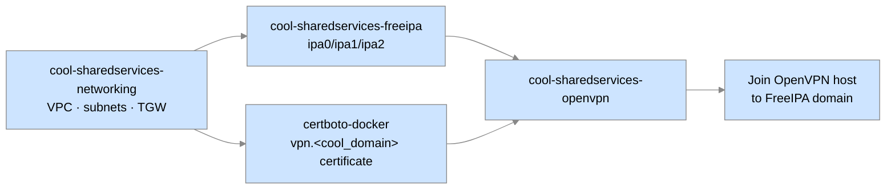

# Phase 6 — Deploy Shared Services #

The Shared Services account hosts the resources every assessment environment depends on: the hub VPC and Transit Gateway, the FreeIPA identity cluster, and the OpenVPN gateway operators use to reach the private network.  This phase deploys them in dependency order and issues the TLS certificates they need.



# Prerequisites #

* [Bootstrap the Core Accounts](Bootstrap-the-Core-Accounts.md) is complete, including the DNS public zone (delegation for `<cool_domain>` resolves publicly), `cool-dns-certboto`, and `cool-images-parameterstore`.
* [Build the Base AMIs](Build-the-Base-AMIs.md) has produced FreeIPA and OpenVPN AMIs shared to the Shared Services account.
* SSM Parameter Store in the `Images` account contains `/openvpn/server/tlscrypt.key` and `/openvpn/server/dh4096.pem` (created in [Build the Base AMIs](Build-the-Base-AMIs.md)).
* Your `cool-sharedservices-provisionaccount`, `cool-sharedservices-startstopssmsession`, `cool-dns-certificatesbucketfullaccess`, and `cool-dns-route53resourcechange-<cool_domain>` profiles work.

# Deploy networking #

`cool-sharedservices-networking` has a small chicken-and-egg of its own: the `ProvisionNetworking` policy that grants the `ProvisionAccount` role permission to build VPC resources is *itself* one of the resources.  A targeted apply attaches the policy first, then a full apply builds the VPC.

1. Create `<tfvars_repo>/cool-sharedservices-networking/<workspace>.tfvars`.  The CIDR plan below is a reasonable default for a `/9` COOL address space; adjust if it collides with anything you peer with:

    ```hcl
    cool_cidr_block = "10.128.0.0/9"
    cool_domain     = "<cool_domain>"
    vpc_cidr_block  = "10.128.0.0/16"

    private_subnet_cidr_blocks = [
      "10.128.0.0/24",
      "10.128.1.0/24",
      "10.128.2.0/24",
    ]
    public_subnet_cidr_blocks = [
      "10.128.16.0/24",
      "10.128.17.0/24",
      "10.128.18.0/24",
    ]

    terraform_state_bucket = "<state_bucket>"

    tags = {
      Team        = "<your_team_name>"
      Application = "COOL - Shared Services Networking"
      Workspace   = "<workspace>"
    }
    ```

1. Targeted apply, then full apply:

    ```console
    cd ~/cool/src/cool-sharedservices-networking
    terraform init -upgrade \
      -backend-config=<tfvars_repo>/cool-sharedservices-networking/<workspace>.tfconfig
    terraform workspace new <workspace>

    terraform apply \
      -var-file=<tfvars_repo>/cool-sharedservices-networking/<workspace>.tfvars \
      -target=aws_iam_policy.provisionnetworking_policy \
      -target=aws_iam_role_policy_attachment.provisionnetworking_policy_attachment

    terraform apply \
      -var-file=<tfvars_repo>/cool-sharedservices-networking/<workspace>.tfvars
    ```

# Deploy the FreeIPA cluster #

The Terraform side stands up three EC2 instances (`ipa0`, `ipa1`, `ipa2`); the FreeIPA software is then configured interactively on each.

1. Create `<tfvars_repo>/cool-sharedservices-freeipa/<workspace>.tfvars`:

    ```hcl
    cool_domain            = "<cool_domain>"
    terraform_state_bucket = "<state_bucket>"

    tags = {
      Team        = "<your_team_name>"
      Application = "COOL - Shared Services FreeIPA"
      Workspace   = "<workspace>"
    }
    ```

1. Apply in stages — the policy attachment first, then each node in order (each replica must see its predecessor before it can enroll), then a final untargeted apply:

    ```console
    cd ~/cool/src/cool-sharedservices-freeipa
    terraform init -upgrade \
      -backend-config=<tfvars_repo>/cool-sharedservices-freeipa/<workspace>.tfconfig
    terraform workspace new <workspace>

    terraform apply -var-file=<tfvars_repo>/cool-sharedservices-freeipa/<workspace>.tfvars \
      -target=aws_iam_policy.provisionfreeipa_policy \
      -target=aws_iam_role_policy_attachment.provisionfreeipa_policy_attachment \
      -target=module.security_groups

    terraform apply -var-file=<tfvars_repo>/cool-sharedservices-freeipa/<workspace>.tfvars -target=module.ipa0
    terraform apply -var-file=<tfvars_repo>/cool-sharedservices-freeipa/<workspace>.tfvars -target=module.ipa1
    terraform apply -var-file=<tfvars_repo>/cool-sharedservices-freeipa/<workspace>.tfvars -target=module.ipa2

    terraform apply -var-file=<tfvars_repo>/cool-sharedservices-freeipa/<workspace>.tfvars
    ```

    Record the three instance IDs from the final apply's output.

1. Configure the master and replicas (substituting your `<cool_domain>` and `<workspace>` throughout):
    1. SSM into `ipa0`, run `sudo /usr/local/sbin/00_setup_freeipa.sh master`, supply the directory-service and admin passwords (retrieve them with `aws ssm get-parameter --name /freeipa/... --with-decryption --profile cool-images-parameterstorereadonly`), and create your `<first.last>` FreeIPA user in the `admins` and `vpnusers` groups.
    1. SSM into `ipa1`, `sudo kinit <first.last>@<COOL_DOMAIN_UPPER>`, run `sudo /usr/local/sbin/00_setup_freeipa.sh replica`.
    1. Repeat on `ipa2`, then add the missing `ipa1↔ipa2` topology segments.

# Issue the OpenVPN certificate #

OpenVPN needs a TLS certificate for `vpn.<cool_domain>` in `<cert_bucket>` before it will deploy.

1. Follow the `certboto-docker` setup in [Creating and Renewing SSL Certificates](../admin-operations/Creating-and-Renewing-SSL-Certificates.md) to configure `certboto-docker`, using:
    * `BUCKET_NAME=<cert_bucket>`
    * `BUCKET_PROFILE=cool-dns-certificatesbucketfullaccess`
    * `DNS_PROFILE=cool-dns-route53resourcechange-<cool_domain>`
1. Issue the certificate:

    ```console
    cd ~/cool/src/certboto-docker
    docker compose -f my-docker-compose.yml run certboto certonly -d vpn.<cool_domain>
    ```

1. Confirm it landed:

    ```console
    aws s3 ls s3://<cert_bucket>/live/vpn.<cool_domain>/ \
      --profile cool-dns-certificatesbucketfullaccess
    ```

# Deploy OpenVPN #

1. Create `<tfvars_repo>/cool-sharedservices-openvpn/<workspace>.tfvars`:

    ```hcl
    cert_bucket_name         = "<cert_bucket>"
    client_dns_search_domain = "<cool_domain>"
    client_dns_server        = "10.128.0.2"          # VPC .2 resolver in the Shared Services VPC
    client_network           = "10.240.0.0 255.255.255.0"
    cool_domain              = "<cool_domain>"
    private_networks = [
      "10.128.0.0 255.128.0.0",                       # everything under cool_cidr_block
    ]
    terraform_state_bucket = "<state_bucket>"

    tags = {
      Team        = "<your_team_name>"
      Application = "COOL - Shared Services OpenVPN"
      Workspace   = "<workspace>"
    }
    ```

1. Apply — targeted `module.openvpn` first, then full:

    ```console
    cd ~/cool/src/cool-sharedservices-openvpn
    terraform init -upgrade \
      -backend-config=<tfvars_repo>/cool-sharedservices-openvpn/<workspace>.tfconfig
    terraform workspace new <workspace>

    terraform apply \
      -var-file=<tfvars_repo>/cool-sharedservices-openvpn/<workspace>.tfvars \
      -target=module.openvpn

    terraform apply \
      -var-file=<tfvars_repo>/cool-sharedservices-openvpn/<workspace>.tfvars
    ```

1. Join the new OpenVPN instance to the FreeIPA domain: SSM into it via `cool-sharedservices-startstopssmsession`, `sudo kinit <first.last>@<COOL_DOMAIN_UPPER>`, then `sudo /usr/local/sbin/00_setup_freeipa.sh`.

# Verify #

* `dig +short vpn.<cool_domain>` returns a public IP.
* You can download the client `.ovpn` from the OpenVPN instance (path shown in the `cool-sharedservices-openvpn` outputs) and connect.
* Once on the VPN, `kinit <first.last>@<COOL_DOMAIN_UPPER>` succeeds from your workstation and `https://ipa0.<cool_domain>/` loads the FreeIPA web UI.

---

**Next:** [Provision the First Assessment Environment](Provision-the-First-Assessment-Environment.md) · **Up:** [GETTING-STARTED.md](GETTING-STARTED.md)
