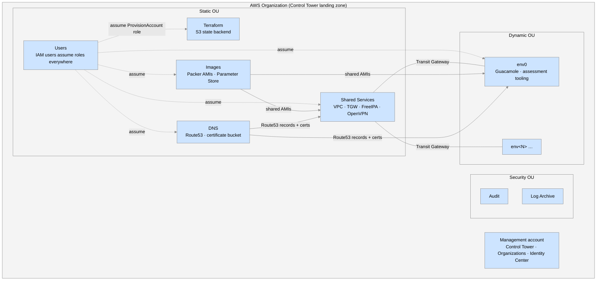
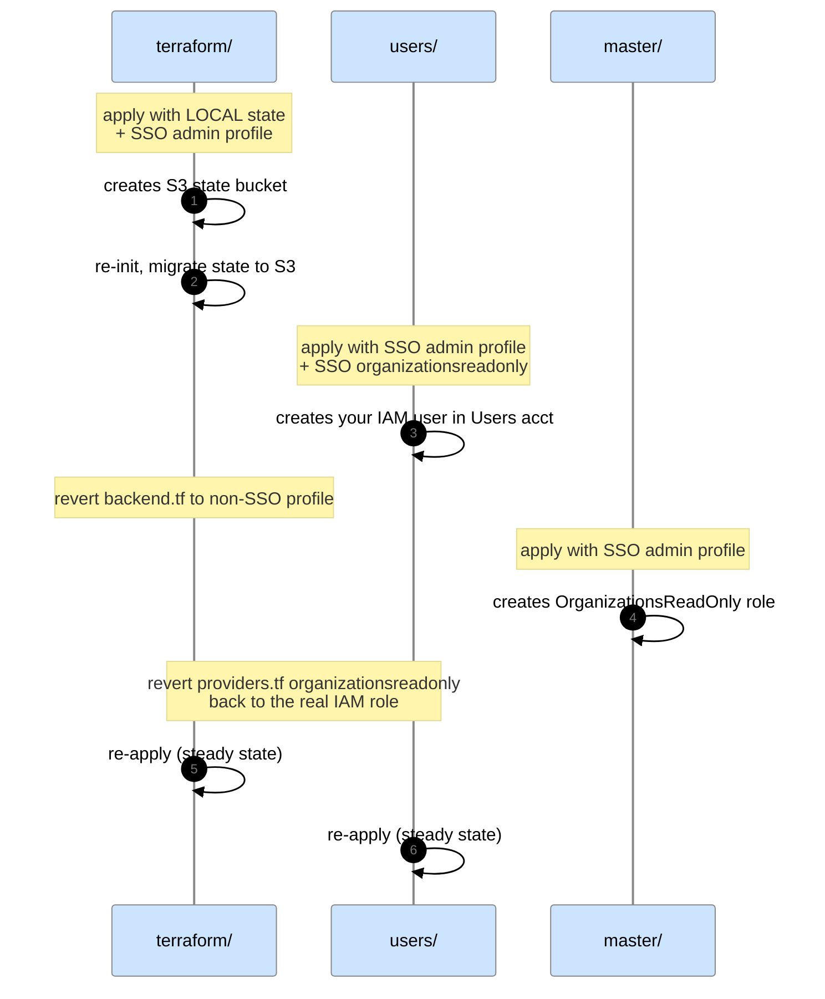

# Getting started: standing up your own COOL #

This guide walks you through building a complete COOL deployment from an empty AWS account to a running assessment environment.  It is written for anyone — you do not need to be part of CISA to follow it.  Every organization-specific value (domain names, account IDs, email addresses, bucket names) is shown as a `<placeholder>` for you to substitute.

The process takes on the order of a working day of hands-on time, plus waiting for AWS Control Tower, account provisioning, and AMI builds.  Almost all of it is command-line driven with Terraform and Packer; the only unavoidable click-ops are the initial Control Tower landing zone and IAM Identity Center configuration.

Read [ARCHITECTURE.md](ARCHITECTURE.md) first so the account names and components below mean something, and see [REPOSITORIES.md](REPOSITORIES.md) for the full map of upstream repos.

# What you will build #



The AWS account layout as a tree:

```text
Root
├── Management (this is the account you start with)
├── Security OU        ← created by Control Tower
│   ├── Audit
│   └── Log Archive
├── Sandbox OU         ← created by Control Tower, unused
├── Static OU          ← long-lived platform accounts you create
│   ├── DNS
│   ├── Images
│   ├── Shared Services
│   ├── Terraform
│   └── Users
└── Dynamic OU         ← one account per assessment environment
    ├── env0
    └── env<N> …
```

# Before you start #

You will need:

* One brand-new AWS account (this becomes the **management account**), with root credentials, MFA enabled on root, and a payment method attached.  Do not reuse an account that already has an AWS Organization or Control Tower landing zone.
* At least eight distinct email addresses — one per member account.  A single mailbox with plus-addressing (e.g. `cool-<env>+terraform@<your_domain>`) works fine.
* A public DNS domain that you control and can delegate a subdomain of to Route 53 (referred to below as `<cool_domain>`, e.g. `cool.example.org`).
* Familiarity with Terraform, Packer, Git, and the AWS CLI.

# Phases #

Work through these pages in order.  Each page lists its own prerequisites and ends with a verification step so you know it is safe to move on.

| # | Phase | What it produces |
|---|---|---|
| 1 | [Prepare Your Workstation](Prepare-Your-Workstation.md) | Local tooling, cloned repos, a private tfvars repo skeleton, and a working AWS credentials layout. |
| 2 | [Set Up the Management Account](Set-Up-the-Management-Account.md) | Control Tower landing zone, `Static`/`Dynamic` OUs, five Static member accounts, IAM Identity Center users, RAM sharing enabled. |
| 3 | [Bootstrap the Terraform Backend](Bootstrap-the-Terraform-Backend.md) | The `Terraform` account holds the S3 state bucket that every other Terraform root uses. |
| 4 | [Bootstrap the Core Accounts](Bootstrap-the-Core-Accounts.md) | `Users`, management, `Audit`, `DNS`, `Images`, `Log Archive`, and `Shared Services` accounts each have a `ProvisionAccount` role and baseline resources. |
| 5 | [Build the Base AMIs](Build-the-Base-AMIs.md) | Encrypted FreeIPA, OpenVPN, Guacamole, and Samba AMIs exist in the `Images` account and are shared to the accounts that need them. |
| 6 | [Deploy Shared Services](Deploy-Shared-Services.md) | Shared Services VPC + Transit Gateway, a three-node FreeIPA cluster, TLS certificates, and an OpenVPN gateway. |
| 7 | [Provision the First Assessment Environment](Provision-the-First-Assessment-Environment.md) | An `env0` account in the `Dynamic` OU running Guacamole and joined to FreeIPA — the smoke test that the whole platform works. |

# About the ordering #

The build has two circular dependencies that are broken by applying, moving on, and then coming back to re-apply.  They are called out explicitly on the relevant pages, but in summary:



Once past this, every remaining account bootstrap follows the same simple pattern (apply once with temporary Identity Center credentials, then re-apply with the permanent `ProvisionAccount` role).

# Terraform repositories used #

All of these are public.  If you are not part of CISA, fork the ones marked ✎ and adjust the hard-coded domain / naming to match your `<cool_domain>`.

| Repository | Purpose | Fork? |
|---|---|---|
| [cisagov/cool-accounts](https://github.com/cisagov/cool-accounts) | Per-account baseline (ProvisionAccount role, alarms, session manager) for every core account. | |
| [cisagov/provision-aws-account](https://github.com/cisagov/provision-aws-account) | Creates member accounts via Control Tower Account Factory. | |
| [cisagov/cool-configure-aws-account](https://github.com/cisagov/cool-configure-aws-account) | Assigns Identity Center permission sets and requests service-quota increases per account. | |
| [cisagov/cool-images-parameterstore](https://github.com/cisagov/cool-images-parameterstore) | Parameter Store access roles in the Images account. | |
| [cisagov/cool-dns-certboto](https://github.com/cisagov/cool-dns-certboto) | Certificate S3 bucket + roles in the DNS account. | |
| [cisagov/cool-dns-cyber.dhs.gov](https://github.com/cisagov/cool-dns-cyber.dhs.gov) | Public Route 53 zone for `<cool_domain>`. | ✎ |
| [cisagov/cool-sharedservices-networking](https://github.com/cisagov/cool-sharedservices-networking) | Shared Services VPC, subnets, and Transit Gateway. | |
| [cisagov/cool-sharedservices-freeipa](https://github.com/cisagov/cool-sharedservices-freeipa) | Three-node FreeIPA identity cluster. | |
| [cisagov/cool-sharedservices-openvpn](https://github.com/cisagov/cool-sharedservices-openvpn) | OpenVPN gateway. | |
| [cisagov/cool-assessment-terraform](https://github.com/cisagov/cool-assessment-terraform) | Per-environment assessment infrastructure (Guacamole, operations subnet, tooling). | |
| [cisagov/*-packer](https://github.com/cisagov?q=packer) | AMI builds for FreeIPA, OpenVPN, Guacamole, Samba, and assessment tooling. | |
| [cisagov/certboto-docker](https://github.com/cisagov/certboto-docker) | Issues Let's Encrypt certificates via Route 53 DNS-01 and stores them in S3. | |
| [cisagov/aws-profile-sync](https://github.com/cisagov/aws-profile-sync) | Keeps the (large) set of `cool-*` AWS CLI profiles in sync across your team. | |

You will also create **one private repository of your own** to hold `*.tfvars` and `*.tfconfig` files (referred to throughout this guide as `<tfvars_repo>`).  Its layout is described in [Prepare Your Workstation](Prepare-Your-Workstation.md).

# When you are done #

After phase 7 you should be able to `aws sso login`, connect to the OpenVPN gateway, `kinit` against FreeIPA, open `https://guac.env0.<cool_domain>` in a browser, and reach a desktop inside `env0`.  Day-to-day operation from that point is covered by the [administrator runbooks](../admin-operations/README.md).

---

**Next:** [Prepare Your Workstation](Prepare-Your-Workstation.md)
