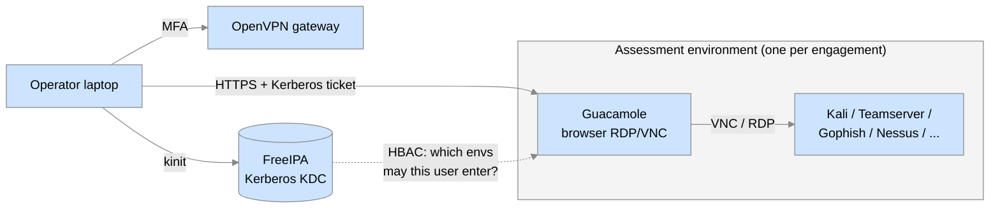

<h1 align="center">

</h1>

# Cloud Optimized Operations Lab (COOL) #

The **Cloud Optimized Operations Lab (COOL)** is an open-source,
infrastructure-as-code platform for running **isolated, ephemeral
security-assessment environments** on AWS.

It was built by [CISA](https://www.cisa.gov/) to support its own
penetration testing, red team, and phishing-assessment missions, but
nothing about the design is government-specific.  Any security team
that needs to repeatedly stand up clean, segregated, fully-tooled
attack infrastructure — and then burn it down when the engagement is
over — can deploy a COOL of their own.

This repository is the **front door**.  It contains no Terraform
itself; it explains what the system is, how the pieces fit together,
and where to go next.

## The problem COOL solves ##

Teams that perform offensive security assessments tend to run into
the same operational headaches:

| Pain point | What usually happens without a platform |
| --- | --- |
| **Cross-contamination** | Operators reuse the same Kali box / C2 server across engagements; client A's data ends up next to client B's. |
| **Snowflake infrastructure** | Each engagement's infra is hand-built and slightly different; nobody can reproduce what was running last quarter. |
| **Access sprawl** | SSH keys and VPN configs accumulate; off-boarding an operator from one engagement (but not others) is manual and error-prone. |
| **Slow spin-up** | Days are lost at the start of every engagement installing tools, requesting IPs, configuring mail relays. |
| **Lingering cost & risk** | "Temporary" cloud instances live forever because no one is sure it's safe to delete them. |

COOL addresses these by treating an assessment environment as a
**disposable, code-defined unit** that lives in its **own AWS
account**, is reached only through a **central identity and remote
desktop gateway**, and is **destroyed in full** when the engagement
ends.

## What you get ##

When you deploy COOL into your own AWS Organization you end up with:

- **A multi-account AWS foundation** managed by AWS Control Tower —
  with dedicated accounts for Terraform state, IAM users, DNS, golden
  images, audit/logging, and shared services.
- **A shared-services hub** containing:
  - A [FreeIPA](https://www.freeipa.org/) cluster for centralized
    identity, Kerberos SSO, and host-based access control (HBAC).
  - An [OpenVPN](https://openvpn.net/) gateway, MFA-enforced, as the
    single network entry point for operators.
  - A Transit Gateway hub that every assessment VPC attaches to.
- **A vending process for assessment environments** — one Terraform
  apply produces a fresh AWS account/VPC containing an
  [Apache Guacamole](https://guacamole.apache.org/) clientless
  remote-desktop gateway plus whatever mix of operator instances the
  engagement needs (Kali, Cobalt Strike teamserver, Gophish, Nessus,
  Windows, Egress-Assess, Samba, Debian desktop, …).
- **Hard isolation between engagements** — separate AWS accounts,
  separate VPCs, separate Transit Gateway route tables; environments
  cannot see each other.
- **Browser-only operator access** — operators authenticate to the
  VPN, get a Kerberos ticket, and reach their tools through Guacamole
  in a browser.  No SSH keys or local tooling on operator laptops.
- **A clean teardown story** — `terraform destroy` removes the
  environment, FreeIPA group membership is revoked, and the AWS
  account goes back into the pool.
- **Pre-baked golden AMIs** for every instance type, built with
  Packer + Ansible, so environments come up tooled and patched.

## How an operator experiences it ##

1. Connect to the COOL VPN with MFA.
2. `kinit` to obtain a Kerberos ticket from FreeIPA.
3. Open `https://guac.<env>.<your-domain>` in a browser — FreeIPA's
   HBAC rules decide which environments this operator may enter.
4. Click an instance tile and get a full remote desktop, with
   clipboard and file transfer, to a freshly imaged tool box.

## Who this is for ##

- Internal red teams / pentest teams that run multiple concurrent
  engagements.
- Security consultancies that want per-client infrastructure
  separation without per-client manual builds.
- Any organization that wants the "spin up → assess → archive →
  destroy" lifecycle to be a repeatable, audited process rather than
  tribal knowledge.

You will need: an AWS Organization you control (or are willing to
create), a public DNS domain, comfort with Terraform, and an
afternoon's patience for the initial bootstrap.

## Repository map ##

COOL is deliberately split across many small, single-purpose
repositories rather than one monorepo — each piece can be versioned,
reviewed, and applied independently.  The full catalogue, grouped by
function, is in **[REPOSITORIES.md](REPOSITORIES.md)**.

The very short version:

| Layer | Key repositories |
| --- | --- |
| AWS account foundation | [`cool-accounts`](https://github.com/cisagov/cool-accounts), [`provision-aws-account`](https://github.com/cisagov/provision-aws-account), [`cool-configure-aws-account`](https://github.com/cisagov/cool-configure-aws-account) |
| Shared services | [`cool-sharedservices-networking`](https://github.com/cisagov/cool-sharedservices-networking), [`cool-sharedservices-freeipa`](https://github.com/cisagov/cool-sharedservices-freeipa), [`cool-sharedservices-openvpn`](https://github.com/cisagov/cool-sharedservices-openvpn) |
| Assessment environments | [`cool-assessment-terraform`](https://github.com/cisagov/cool-assessment-terraform) |
| Golden images (AMIs) | [`guacamole-packer`](https://github.com/cisagov/guacamole-packer), [`kali-packer`](https://github.com/cisagov/kali-packer), [`openvpn-packer`](https://github.com/cisagov/openvpn-packer), [`freeipa-server-packer`](https://github.com/cisagov/freeipa-server-packer), … |
| Operator tooling | [`aws-profile-sync`](https://github.com/cisagov/aws-profile-sync), [`certboto-docker`](https://github.com/cisagov/certboto-docker) |

## Where to go next ##

| If you want to… | Read |
| --- | --- |
| Understand the account topology, network design, and identity model | [**ARCHITECTURE.md**](ARCHITECTURE.md) |
| See every repository and what it does | [**REPOSITORIES.md**](REPOSITORIES.md) |
| Actually stand one of these up in your own AWS org | [**GETTING-STARTED.md**](GETTING-STARTED.md) |
| Run day-2 operations (add users, provision/destroy environments, rotate certs) | The [administrator runbooks](../admin-operations/README.md) |

## A note on CISA-specific bits ##

The reference implementation uses CISA's own values in a few places —
the `cyber.dhs.gov` DNS zone, PIV smart-card certificate mapping in
FreeIPA, and a CDM (Continuous Diagnostics and Mitigation) integration
repo.  These are called out explicitly in
[GETTING-STARTED.md](GETTING-STARTED.md#what-you-will-customize) so
you know exactly what to fork and re-point at your own domain and
identity sources.  Everything else is organization-agnostic.

## Contributing ##

We welcome contributions!  Please see
[`CONTRIBUTING.md`](../CONTRIBUTING.md) for details.

## License ##

This project is in the worldwide [public domain](../LICENSE) (CC0 1.0
Universal).  All contributions to this project will be released under
the CC0 dedication.
